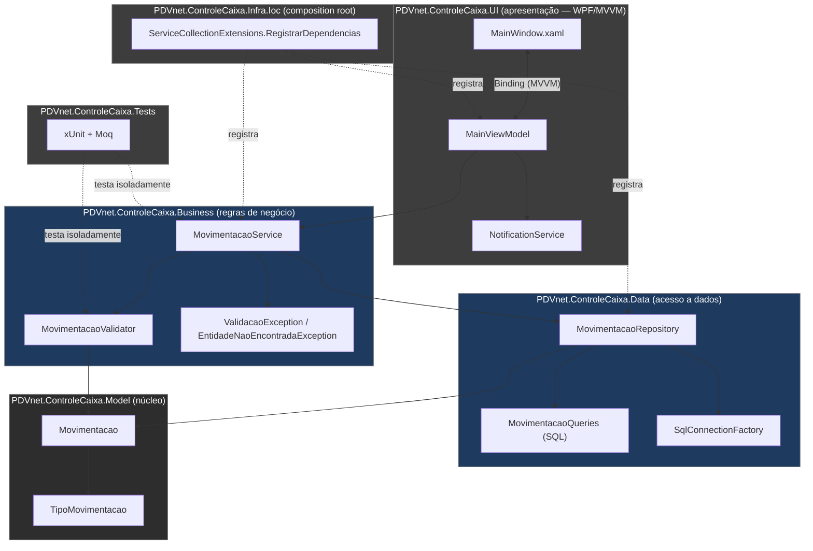

<div align="center">

# PDVnet.ControleCaixa

**Aplicação desktop de controle de caixa** desenvolvida em C# / WPF com SQL Server, aplicando arquitetura em camadas, MVVM e injeção de dependência.


</div>

---

Projeto desenvolvido para o **processo seletivo de Desenvolvedor Júnior da PDVnet**.

## Sumário

- [Por que este projeto existe](#por-que-este-projeto-existe)
- [Arquitetura](#arquitetura)
- [Como as camadas se conectam](#como-as-camadas-se-conectam)
- [Stack técnica](#stack-técnica)
- [Quickstart](#quickstart)
- [Estrutura do repositório](#estrutura-do-repositório)
- [Decisões de design](#decisões-de-design)
- [Regras de negócio](#regras-de-negócio)
- [Testes](#testes)
- [Estado atual e limitações conhecidas](#estado-atual-e-limitações-conhecidas)
- [Filtro de consulta (extra)](#filtro-de-consulta-extra)
- [Validação numérica no formulário (extra)](#validação-numérica-no-formulário-extra)
- [Roadmap](#roadmap)

---

## Por que este projeto existe

O enunciado pede um CRUD de movimentações de caixa — mas um CRUD "bruto" (uma tela falando direto com o banco) não mostra muito sobre como o candidato organiza um projeto real. Este repositório existe para responder uma pergunta diferente: **como estruturar uma aplicação desktop para que a UI, a regra de negócio e o acesso a dados não fiquem amarrados entre si** — permitindo, por exemplo, testar toda a regra de negócio (validação, cálculo de saldo, tratamento de "entidade não encontrada") **sem precisar de um SQL Server rodando**.

Para isso, o projeto isola em 6 projetos .NET separados:
- **regras de negócio** (`Business`) — descrição/tipo/valor obrigatórios, valor sempre positivo, sinal definido pelo tipo — validadas antes de qualquer acesso a dados;
- **acesso a dados** (`Data`) — SQL puro via ADO.NET, escondido atrás de uma interface (`IMovimentacaoRepository`), para que a camada de negócio não saiba (nem precise saber) que existe um SQL Server do outro lado;
- **composição de dependências** (`Infra.Ioc`) — um único lugar registra tudo, evitando `services.AddX()` espalhado pelo `App.xaml.cs`.

## Arquitetura



**Regra de dependência:** as setas de importação sempre apontam para o `Model`. Ele não conhece WPF, SQL Server ou nenhuma outra camada — é só POCO (`Movimentacao`) e um enum (`TipoMovimentacao`). Isso é o que permite ao `PDVnet.ControleCaixa.Tests` validar as regras de negócio do `MovimentacaoService` mockando o `IMovimentacaoRepository`, sem subir banco de dados nenhum.

| Camada | Responsabilidade | Depende de |
|---|---|---|
| `Model` | Entidade `Movimentacao` e enum `TipoMovimentacao` — sem lógica, sem dependências | nada |
| `Business` | Casos de uso (`MovimentacaoService`), validação (`MovimentacaoValidator`), exceptions de domínio | `Model`, interface `IMovimentacaoRepository` (de `Data`) |
| `Data` | Implementação do repositório em ADO.NET puro, factory de conexão, SQL das queries | `Model` |
| `Infra.Ioc` | Composition root: registra `IMovimentacaoRepository`, `IMovimentacaoService` etc. no container de DI | `Business`, `Data` |
| `UI` | Janela WPF, ViewModels (MVVM), mapeamento Entity↔ViewModel, notificações (`MessageBox`) | `Infra.Ioc`, `Business.Interfaces` |
| `Tests` | Testes unitários da camada `Business` (`xUnit` + `Moq`) | `Business`, `Data` (só a interface), `Model` |

## Como as camadas se conectam

Para deixar claro que não é só um diagrama bonito, aqui está o caminho real percorrido quando o usuário clica em **"Salvar"** para cadastrar uma movimentação:

1. **`MainWindow.xaml`** → o `Binding` no `TextBox` já atualizou `MainViewModel.Movimentacao` (a cada tecla ou ao perder o foco, dependendo do campo). O clique no botão dispara `SalvarCommand`, que é o `[RelayCommand]` `SalvarAsync()` no **`MainViewModel`** (camada `UI`).
2. **`MainViewModel.SalvarAsync()`** converte o `MovimentacaoViewModel` (o que a tela edita) em uma entidade `Movimentacao` (o que o domínio entende) através do **`MovimentacaoMapper`**, e chama `_movimentacaoService.InserirAsync(movimentacao)` — a `UI` só conhece a **interface** `IMovimentacaoService`, nunca a implementação concreta (isso é resolvido em tempo de execução pelo `Infra.Ioc`).
3. **`MovimentacaoService.InserirAsync`** (camada `Business`) primeiro chama `MovimentacaoValidator.Validar(movimentacao)`. Se a descrição estiver vazia, o valor for ≤ 0, ou o tipo for inválido, uma **`ValidacaoException`** é lançada aqui — a query SQL de inserção **nunca chega a ser montada**.
4. Se passou na validação, o `Service` marca `Status = true` e delega a persistência para `_repository.InserirAsync(movimentacao)` — de novo, através da interface `IMovimentacaoRepository`, definida em `Data.Repositories.Interfaces` mas **implementada por `MovimentacaoRepository`**, que é quem o `Infra.Ioc` efetivamente injeta.
5. **`MovimentacaoRepository.InserirAsync`** (camada `Data`) abre uma `SqlConnection` via `SqlConnectionFactory` (que lê a connection string do `App.config`), monta os parâmetros do `SqlCommand` com o SQL definido em **`MovimentacaoQueries.Inserir`**, e executa o `INSERT ... OUTPUT INSERTED.Id` no SQL Server.
6. O `Id` gerado volta pela mesma cadeia até o `MainViewModel`, que então recarrega a lista (`CarregarMovimentacoesAsync`) e o saldo (`AtualizarSaldoAsync`), atualizando o `DataGrid` e o card de "Saldo Atual" automaticamente via `INotifyPropertyChanged` (data binding do WPF).
7. Se qualquer exceção não tratada ocorrer no caminho, o `catch` no `MainViewModel` chama `_notificationService.Error(...)`, que exibe um `MessageBox` — a `UI` nunca captura exceções de SQL diretamente, apenas o que já foi traduzido em `ValidacaoException` / `EntidadeNaoEncontradaException` pela camada `Business`.

O mesmo padrão se repete para **Atualizar**, **Excluir** e **Consultar Saldo** — o que muda é apenas qual método da interface é chamado.

**Fluxo de pesquisa com filtro:** ao clicar em **"Pesquisar"** no painel de filtros, `MainViewModel.PesquisarAsync()` monta um `MovimentacaoFiltro` (via `CriarFiltro()`) com os critérios preenchidos na tela (`DataInicial`, `DataFinal`, `TipoFiltro`, `CategoriaFiltro`) e chama `_movimentacaoService.PesquisarAsync(filtro)`. O `Service` apenas repassa a chamada para `_repository.PesquisarAsync(filtro)` — a filtragem em si não é regra de negócio, é uma questão de consulta, então fica inteiramente na camada `Data`. O `MovimentacaoRepository` executa uma única query parametrizada (`MovimentacaoQueries.Pesquisar`) que aplica o padrão `(@Parametro IS NULL OR Coluna = @Parametro)` para cada critério — se o usuário não preencheu "Categoria", por exemplo, `@Categoria` chega como `DBNull.Value` e a condição vira sempre verdadeira, ignorando aquele filtro. O botão **"Limpar"** simplesmente zera os campos do filtro e recarrega a listagem completa via `AtualizarTelaAsync`.

## Stack técnica

| Categoria | Tecnologia | Observação |
|---|---|---|
| Runtime | .NET SDK | **8.0** |
| UI | WPF | padrão **MVVM**, sem code-behind com lógica de negócio |
| MVVM Toolkit | CommunityToolkit.Mvvm | `[ObservableProperty]` e `[RelayCommand]` (source generators) |
| Acesso a dados | ADO.NET puro (`Microsoft.Data.SqlClient`) | SQL explícito, sem ORM — ver [Decisões de design](#decisões-de-design) |
| Banco de dados | SQL Server | script versionado em `Data/Scripts/ScriptSQL.sql` |
| Injeção de dependência | `Microsoft.Extensions.Hosting` + `Microsoft.Extensions.DependencyInjection` | composition root único em `Infra.Ioc` |
| Testes | xUnit + Moq | mock de `IMovimentacaoRepository` para isolar a camada `Business` |

## Quickstart

```bash
# 1. Clonar
git clone https://github.com/CVieiraSantos/PDVnet.ControleCaixa.git
cd PDVnet.ControleCaixa

# 2. Restaurar dependências de todos os projetos da solução
dotnet restore

# 3. Criar o banco de dados — execute o script abaixo no seu SQL Server
#    (SSMS, Azure Data Studio ou sqlcmd). É idempotente: pode rodar mais de uma vez.
#    PDVnet.ControleCaixa.Data/Scripts/ScriptSQL.sql

# 4. Configurar a connection string em
#    PDVnet.ControleCaixa.UI/App.config -> connectionStrings:DefaultConnection
#    (troque "Server=..." pela sua instância local, ex: (localdb)\MSSQLLocalDB)

# 5. Rodar a aplicação
dotnet run --project PDVnet.ControleCaixa.UI

# 6. Rodar os testes
dotnet test PDVnet.ControleCaixa.Tests
```

## Estrutura do repositório

<details>
<summary>Clique para expandir</summary>

```
PDVnet.ControleCaixa/
│
├── PDVnet.ControleCaixa.Model/            # Núcleo — sem dependências
│   ├── Entities/Movimentacao.cs
│   └── Enums/TipoMovimentacao.cs
│
├── PDVnet.ControleCaixa.Business/         # Regras de negócio
│   ├── Interfaces/IMovimentacaoService.cs
│   ├── Services/MovimentacaoService.cs
│   ├── Validators/MovimentacaoValidator.cs
│   └── Exceptions/
│       ├── ValidacaoException.cs
│       └── EntidadeNaoEncontradaException.cs
│
├── PDVnet.ControleCaixa.Data/              # Acesso a dados (ADO.NET)
│   ├── Repositories/
│   │   ├── Interfaces/IMovimentacaoRepository.cs
│   │   ├── MovimentacaoRepository.cs
│   │   └── Queries/MovimentacaoQueries.cs
│   ├── Connection/
│   │   ├── IConnectionFactory.cs
│   │   └── SqlConnectionFactory.cs
│   └── Scripts/ScriptSQL.sql
│
├── PDVnet.ControleCaixa.Infra.Ioc/         # Composition root
│   └── DependencyInjection/ServiceCollectionExtensions.cs
│
├── PDVnet.ControleCaixa.UI/                 # Apresentação (WPF/MVVM)
│   ├── ViewModels/
│   │   ├── MainViewModel.cs
│   │   ├── MovimentacaoViewModel.cs
│   │   └── ViewModelBase.cs
│   ├── Mappings/MovimentacaoMapper.cs
│   ├── Services/
│   │   ├── INotificationService.cs
│   │   └── NotificationService.cs
│   ├── Enums/EstadoTela.cs
│   ├── MainWindow.xaml / MainWindow.xaml.cs
│   ├── App.xaml / App.xaml.cs
│   └── App.config
│
├── PDVnet.ControleCaixa.Tests/              # Testes unitários (xUnit + Moq)
│   ├── Business/Validators/MovimentacaoValidatorTests.cs
│   └── Business/Services/MovimentacaoServiceTests.cs
│
├── PDVnet.ControleCaixa.slnx
└── README.md
```

</details>

## Decisões de design

- **ADO.NET puro em vez de EF Core.** O enunciado pede explicitamente "Utilização de SQL para Queries", então optei por escrever o SQL manualmente (`MovimentacaoQueries`) em vez de um ORM — o que também deixa explícito exatamente qual comando é executado contra o banco, sem a "mágica" de um Change Tracker.
- **Repository Pattern com interface no lado do consumidor.** `IMovimentacaoRepository` é referenciada por `Business`, mas implementada em `Data` — a camada de negócio nunca importa `Microsoft.Data.SqlClient`. Isso é o que viabiliza mockar o repositório nos testes sem precisar de um banco de verdade.
- **Validação centralizada e estática (`MovimentacaoValidator`).** Em vez de espalhar `if` de validação pelo `Service` ou pela `ViewModel`, todas as regras (Descrição, Valor, Tipo) ficam num único lugar, chamado tanto em `InserirAsync` quanto em `AtualizarAsync` — evita divergência de regra entre cadastro e edição.
- **Exceptions de domínio (`ValidacaoException`, `EntidadeNaoEncontradaException`).** A `UI` nunca precisa saber se um erro veio do SQL Server ou de uma regra de negócio — ela só captura essas exceptions específicas e mostra a mensagem adequada via `INotificationService`.
- **Composition root único (`Infra.Ioc`).** Toda a configuração de DI fica isolada em `ServiceCollectionExtensions.RegistrarDependencias`, evitando que `App.xaml.cs` vire um acumulado de `services.AddX()` espalhado.
- **MVVM com CommunityToolkit.Mvvm.** `[ObservableProperty]` e `[RelayCommand]` eliminam boilerplate de `INotifyPropertyChanged` e `ICommand` manual, mantendo o `MainViewModel` legível.

## Regras de negócio

- A **Descrição**, o **Tipo** e o **Valor** de uma movimentação são campos obrigatórios.
- O **Valor** não pode ser negativo nem igual a zero; o sinal da movimentação é definido exclusivamente pelo campo **Tipo** (`Entrada` soma, `Saída` subtrai).
- A **data/hora do lançamento** (`DataMovimento`) é gerada automaticamente no momento da criação, via `GETDATE()` no próprio `INSERT`.
- O **saldo do caixa** é calculado no banco de dados como a soma de todas as Entradas menos a soma de todas as Saídas (`MovimentacaoQueries.ObterSaldo`).
- Um **alerta visual** (texto vermelho) é exibido no dashboard quando o saldo atual fica abaixo de **R$ 100,00**.

## Testes

```bash
dotnet test PDVnet.ControleCaixa.Tests
```

O projeto `PDVnet.ControleCaixa.Tests` cobre a camada `Business` de forma isolada — **sem conexão com banco de dados** — usando **xUnit** para execução e **Moq** para simular o `IMovimentacaoRepository`:

- **`MovimentacaoValidatorTests`**: garante que descrição vazia, valor ≤ 0 e tipo inválido lançam `ValidacaoException`, e que uma movimentação válida passa sem erro.
- **`MovimentacaoServiceTests`**: garante que `InserirAsync` valida antes de persistir (e **não** chama o repositório se a validação falhar), que `AtualizarAsync`/`ExcluirAsync` lançam `EntidadeNaoEncontradaException` quando o `Id` não existe, e que `ObterSaldoAsync` repassa corretamente o valor calculado pelo repositório.

## Estado atual e limitações conhecidas

Para ser transparente sobre o estágio do projeto:

- A coluna `Status` na tabela `MovimentacaoCaixa` foi modelada para permitir exclusão lógica (soft delete), mas `ExcluirAsync` hoje faz um `DELETE` físico no banco.
- A connection string em `App.config` está fixada para uma instância local (`Trusted_Connection`) — é necessário ajustá-la manualmente para rodar em outra máquina.


## Filtro de consulta (extra)

Além de `ObterTodasAsync`, o repositório expõe `ObterComFiltroAsync(MovimentacaoFiltro)`, que monta dinamicamente a cláusula `WHERE` de acordo com os critérios informados — todos opcionais e combináveis:

- **Período** (`DataInicio` / `DataFim`) — filtra por `DataMovimento`.
- **Tipo** (`Entrada` ou `Saída`).
- **Categoria** — busca parcial (`LIKE '%valor%'`).

Os valores são sempre enviados como `SqlParameter`, nunca concatenados na string SQL — a única parte "dinâmica" é *quais* cláusulas `AND` entram na query, não os valores em si, o que evita SQL Injection.

Na UI, o painel de filtro (acima da grade) permite combinar os critérios e limpar o filtro com um clique, voltando à listagem completa.

## Validação numérica no formulário (extra)

O campo **Valor** usa um *attached behavior* reutilizável (`Behaviors/NumericOnlyBehavior`) que impede a digitação de letras, bloqueia colagem de texto inválido (`Ctrl+V`) e permite no máximo uma casa decimal com até 2 dígitos — compatível com a coluna `DECIMAL(10,2)` do banco. Diferente de validar só no `Binding`, o usuário recebe feedback imediato: o caractere inválido simplesmente não aparece no campo.


---

<div align="center">

Desenvolvido por [**Carlos Vieira Santos**](https://github.com/CVieiraSantos)

</div>
